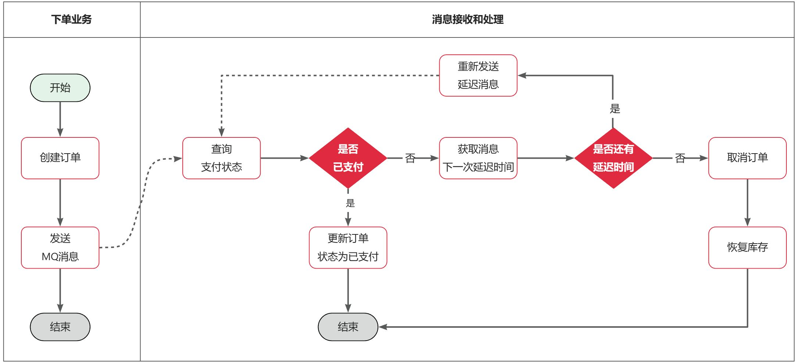

# 黑马商城
此项目实现了虎哥文档里的一些练习题
文档地址: https://b11et3un53m.feishu.cn/wiki/A9SawKUxsikJ6dk3icacVWb4n3g
## 实现改造下单功能，基于RabbitMQ的异步通知
- 定义topic类型交换机，命名为```trade.topic```
- 定义消息队列，命名为```cart.clear.queue```
- 将```cart.clear.queue```与```trade.topic```绑定，BindingKey为```order.create```
- 下单成功时不再调用清理购物车接口，而是发送一条消息到```trade.topic```，发送消息的RoutingKey为```order.create```，消息内容是下单的具体商品、当前登录用户信息
- 购物车服务监听```cart.clear.queue```队列，接收到消息后清理指定用户的购物车中的指定商品

## 实现支付订单超时取消功能

- 在```IOrderService```接口中定义```cancelOrder```方法, 并且在```OrderServiceImpl```中实现该方法
- 实现查询支付服务功能
- 实现更改支付订单未超时未支付功能
